# weighted_rr
The weight of each master is defined as the grant time slice that the master can configure in the arbiter. If all the masters have the same amount of weight, each master will get an equal time. If master A requests 20 cycles and master B requests 10 cycles, master A will get grant 2 times longer than master B. One disadvantage of letting the masters configure the weight is that a master may configure a very large weight. To reduce this large weight problem, another global configurable maximum allowed weight is added. A master may request a very large weight value, but the arbiter will only grant up to the maximum allowed
weight if there are other masters waiting.

# weight decoder
Weight decoder decodes one-hot grant to decode the correct weight of the granted master. Weight of the masters are concatenated to form a weight bus, the width of the bus can be calculated by the width of a single weight and the total number of masters in the arbiter. Weight decoder takes the current grant as an one-hot input. The input grant is decoded to produce an index for correct bit slice positions of the weight bus. For example, if the grant is b ′0010, the index output is 1. Index of 1 stands for the master no. 1. The weight of master 1 is decoded as an output. If the grant is b ′0100, index output is 2. The weight of master 2 is decoded as an output.


# Next Grant Precalculator
Next Grant PReCalculator(NGPRC) calculates the next possible grants mask based on the current grant. By precalculating the next possible grants, NGPRC dictates the Round Robin arbitration of the arbiter. For example, if all 4 masters in the arbiter are requesting and the current grant is master 1, the next possible grant is restricted to be in the order of master 2, master 3 and master 0. The arbiter cannot skip master 2 to grant master 3. It would violate the Round-robin scheme and it is not allowed. By giving the next possible grant priority to the Grant State-machine, it forces the grant to be in strict Round-robin order. . For example, if the current grant is b′0010, rotate left gives b ′0100. After inversion, the bits become b ′1011. After increment by 1, the next possible grant becomes b ′1100. It means the leftmost 2 bits are in line in priority.

# Grant State Machine
Grant state machine is the logic to calculate which master gets the grant and for how long based on the weight. The grant logic is based on the requests and next grant priority mask created by NGPRC. “Grant Process” state masks requests using a precalculated mask to grant the next requesting master. After the grant is decided, it moves to the “Get Weight” state to fetch the weight of the grant from Weight Decoder. After that, it moves to the “Count” state to count the clock cycles until the local counter reaches the desired weight.


# Output


# Coverage:


# Prepared by:
B M Madhumitha


# References

Toe, Aung, "Design and Verification of a Round-Robin Arbiter" (2018). Thesis. Rochester Institute of Technology

# Washing Machine Simulator — Behavior & Control Flow

**Name:** B M Madhumitha  
**Course:** PhD ESE  
**SR No.:** 04-01-00-10-12-26-01-28178

## Overview

This project is a console-based washing machine simulator written in C using.

The main modified logic is contained in:

| File | Responsibility |
|---|---|
| `machine.c` | Machine state, mode selection, Start/Abort, door control, and detergent logic |
| `timer.c` | Wash durations, countdown, timer thread, and completion |
| `power.c` | Power-off handling and power restoration |

Supporting files provide input handling, display, program entry, and declarations.

> **Simulation rule:** 1 real second represents 1 simulated minute.


## 1. Machine State Model

The machine uses these states:

| State | Meaning |
|---|---|
| `IDLE` | Machine is ready for a new cycle |
| `WAITING_FOR_DETERGENT` | Start was requested, but detergent is missing |
| `RUNNING` | Wash cycle is active |
| `POWER_FAILURE` | Power has been switched off while the machine requires recovery |
| `COMPLETED` | Temporary completion state before reset to `IDLE` |
| `ABORTED` | Temporary abort state before reset to `IDLE` |

The door has three possible conditions:

| Door state | Meaning |
|---|---|
| `DOOR_OPEN` | Door is open |
| `DOOR_CLOSED` | Door is closed but not locked |
| `DOOR_LOCKED` | Door is locked during a running cycle or power-failure recovery |

### Wash Modes

| Mode | Duration |
|---|---:|
| Heavy | 45 minutes |
| Normal | 30 minutes |
| Light | 20 minutes |


## 2. Initial Startup

`machine_init()` initializes, turns power ON, sets `simulator_running`, and resets the machine to `IDLE`.

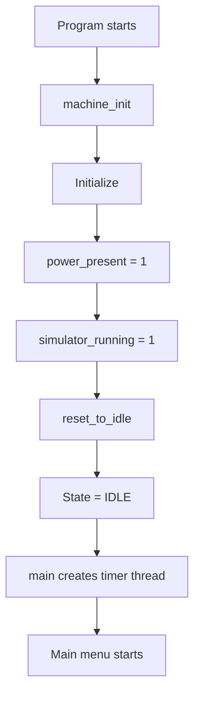

Initial machine condition:

| Property | Value |
|---|---|
| Power | ON |
| Mode | `MODE_NONE` |
| State | `IDLE` |
| Door | OPEN |
| Remaining time | 0 |
| Detergent | EMPTY |
| Start request | NONE |
| Timer | STOPPED |

## 3. Selecting a Wash Mode

`machine_select_mode()` performs these checks in this order:

1. Power must be ON.
2. State must not be `POWER_FAILURE`.
3. The requested mode must be valid.
4. The machine must not be `RUNNING`.
5. The machine must not be `WAITING_FOR_DETERGENT`.

If all checks pass, the selected mode is stored.

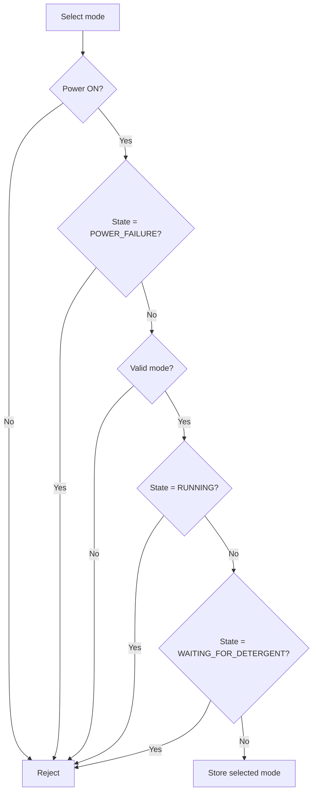

## 4. Start Operation

`machine_start()` first checks power and `POWER_FAILURE`, then calls `machine_start_locked()`.

`machine_start_locked()` performs the actual start checks.

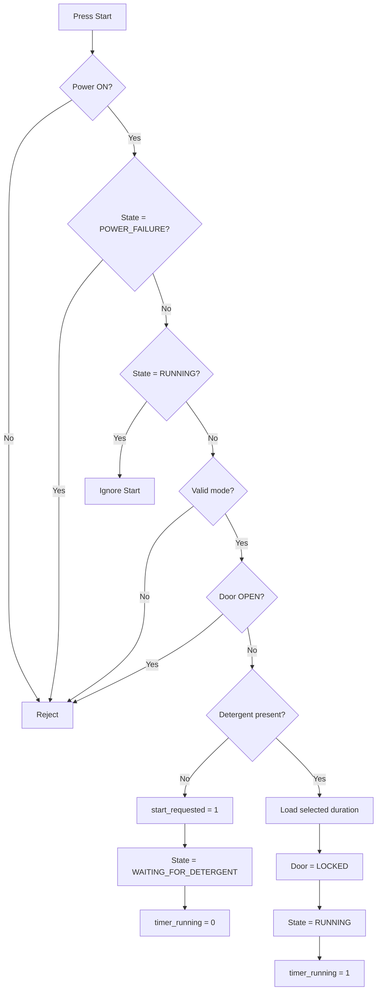

### Important Start Detail

The actual code does **not** require the door to be specifically `DOOR_CLOSED`. It only rejects `DOOR_OPEN`.

Therefore:

```text
DOOR_CLOSED + detergent
    → RUNNING

DOOR_CLOSED + no detergent
    → WAITING_FOR_DETERGENT

DOOR_OPEN
    → Start rejected
```

## 5. Start Pending for Detergent

A pending Start request is created only when:

```text
Power = ON
State = IDLE or WAITING_FOR_DETERGENT
Valid mode selected
Door != OPEN
Detergent = EMPTY
```

The code then sets:

```text
start_requested = 1
state = WAITING_FOR_DETERGENT
timer_running = 0
```

The timer does not run.

### Source-Accurate Pending Flow

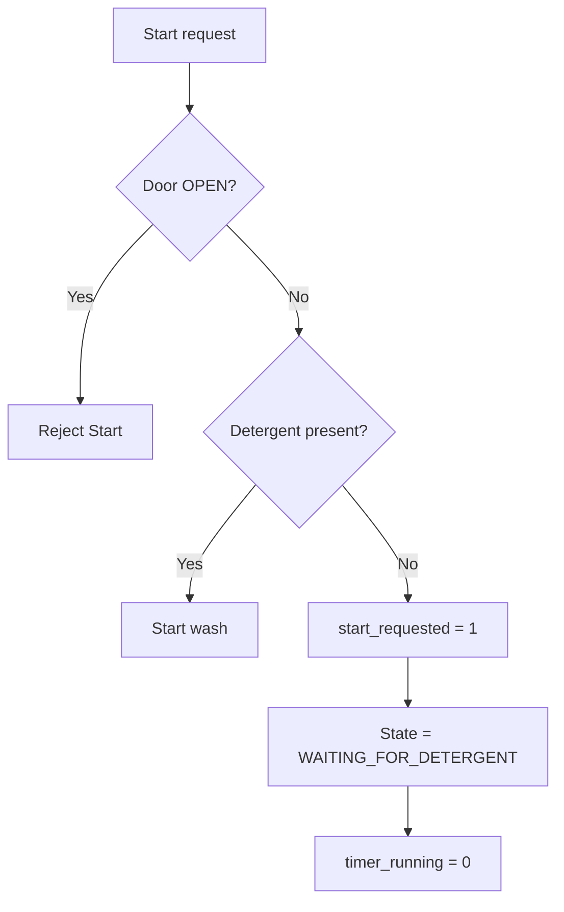

## 6. Door Control

### Opening the Door

`machine_open_door()` rejects opening when:

- Power is OFF
- State is `POWER_FAILURE`
- Door is already locked
- Door is already open

Otherwise the door becomes `DOOR_OPEN`.

The source contains a commented-out special restriction for `WAITING_FOR_DETERGENT`; because it is commented out, that restriction is **not active**.

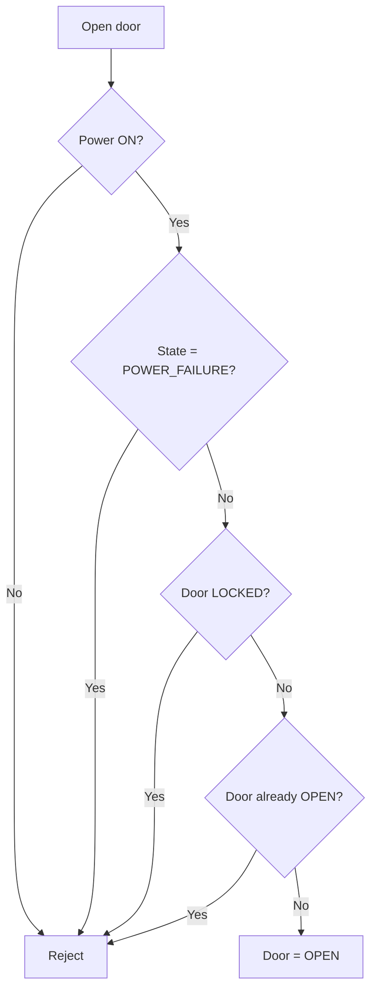

### Closing the Door

`machine_close_door()` rejects closing when:

- Power is OFF
- State is `POWER_FAILURE`
- Door is already locked
- Door is already closed

Otherwise the door becomes `DOOR_CLOSED`.

There is then an automatic-start check.

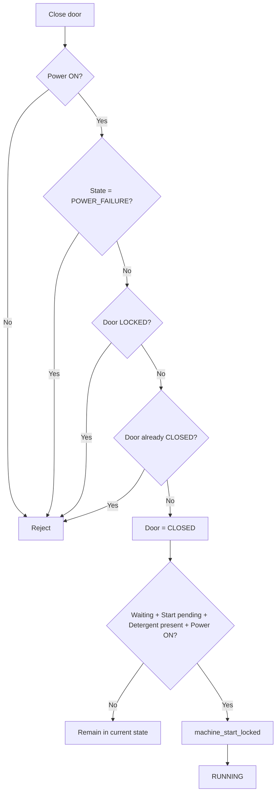

## 7. Detergent Operation

`machine_fill_detergent()` checks:

1. Power is ON.
2. State is not `POWER_FAILURE`.
3. Detergent is not already present.

Then:

```text
detergent_present = 1
```

If a Start request is pending, the result depends on the door.

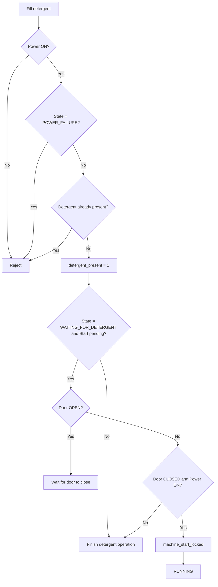

### Pending Start Sequence

The intended successful pending sequence is:

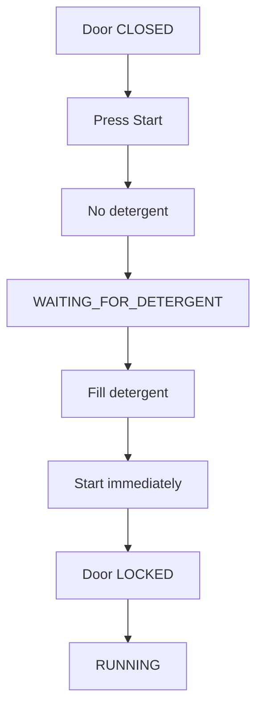

If the door is OPEN when detergent is filled, the machine remains in `WAITING_FOR_DETERGENT` and waits for the user to close the door.

## 8. Timer Thread

`timer_thread()` runs continuously until `simulator_running` becomes false.

Every loop:

1. Sleep for 1 second.
2. Read `simulator_running`.
3. Exit if it is false.
4. Otherwise call `timer_tick()`.

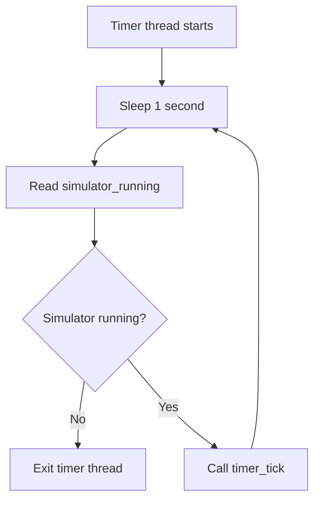

### Timer Tick

`timer_tick()` only performs a countdown when:

```text
state == RUNNING
timer_running == 1
power_present == 1
```

Otherwise, it returns without changing the remaining time.

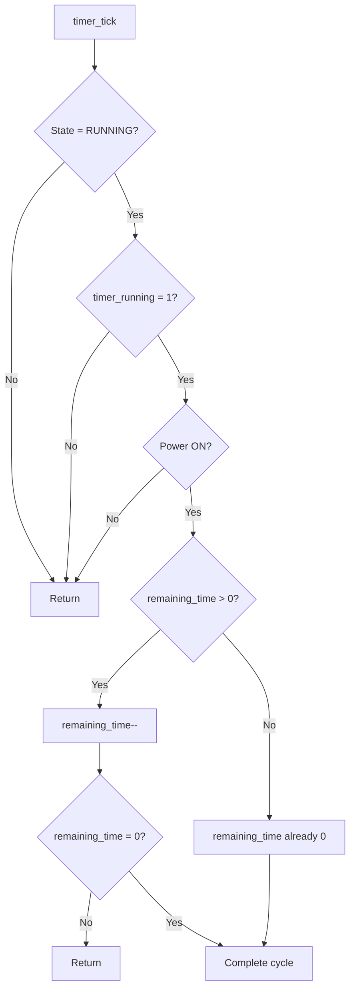

## 9. Wash Completion

When the remaining time reaches zero, `timer_tick()` first sets:

```text
state = COMPLETED
door_status = DOOR_OPEN
timer_running = 0
start_requested = 0
```

Then it resets the machine to `IDLE`.

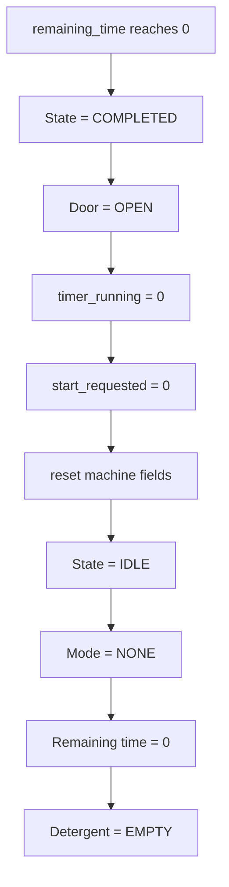

Therefore the observable sequence is:

```text
RUNNING → COMPLETED → IDLE
```

`COMPLETED` is very short-lived because `timer_tick()` immediately resets the machine.

## 10. Abort

`machine_abort()` only acts when:

```text
state == RUNNING
```

If the cycle is active:

```text
state = ABORTED
door_status = DOOR_OPEN
timer_running = 0
start_requested = 0
```

Then `reset_to_idle()` is called.

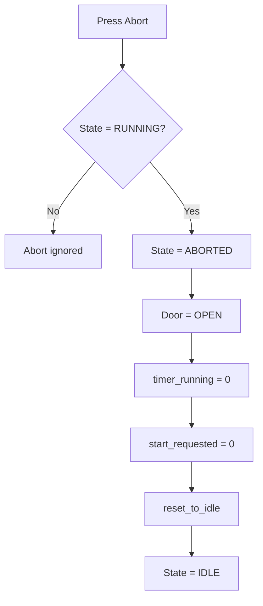

`ABORTED` is therefore also a temporary state.

## 11. Power Failure

`power_failure()` first verifies that power is currently ON.

It then sets:

```text
power_present = 0
```

The subsequent behavior depends on the current state.

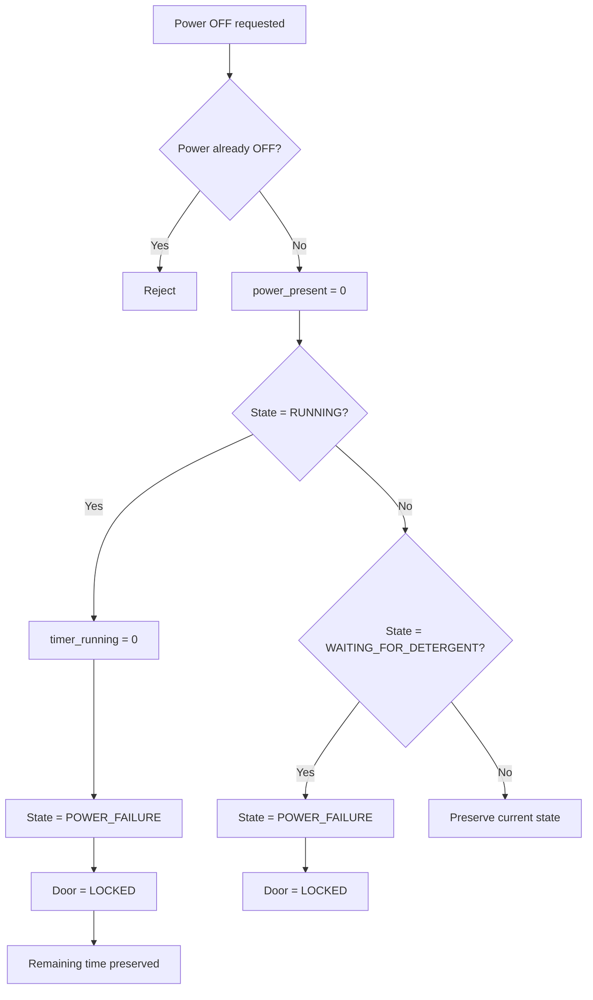

### Important Power-Failure Detail

If the machine is `RUNNING`, the remaining time is **not modified**.

Example:

```text
Normal cycle = 30 minutes
Remaining time = 22 minutes
Power OFF
Remaining time = 22 minutes
```

## 12. Power Restoration

`power_restore()` first verifies that power is currently OFF, then sets:

```text
power_present = 1
```

Only if the previous state is `POWER_FAILURE` does it perform recovery logic.

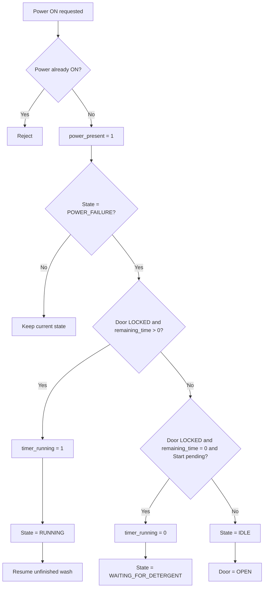

### Recovery of an Interrupted Wash

The normal recovery path is:


The wash therefore resumes from the preserved remaining time.

### Important Edge Case in the Source

There is a specific recovery branch for:

```text
Door = LOCKED
remaining_time = 0
start_requested = 1
```

In that case power restoration sets:

```text
state = WAITING_FOR_DETERGENT
timer_running = 0
```

The source itself does not reset the door to OPEN in this branch.

## 13. Overall State Flow

The following diagram represents the **actual state-changing paths present in the supplied code**. Powering OFF while in `IDLE` does **not** change the machine state to `POWER_FAILURE`; the source preserves the current state.

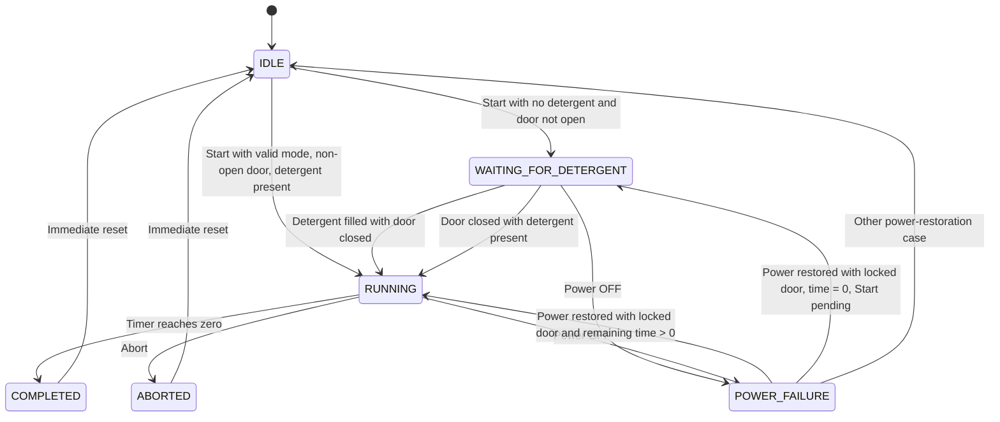

## 14. Normal Successful Wash

A direct successful cycle can be represented as:

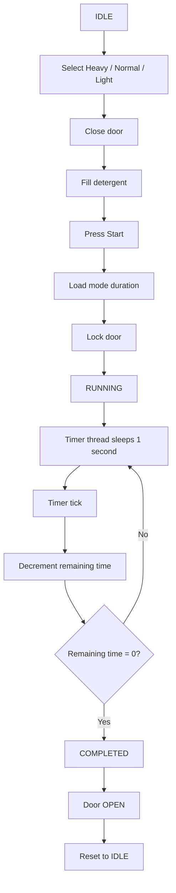

The order of **Fill Detergent** and **Close Door** may be reversed.

The critical condition at Start is that the door must not be `DOOR_OPEN`.

## 15. Power Interruption During a Wash

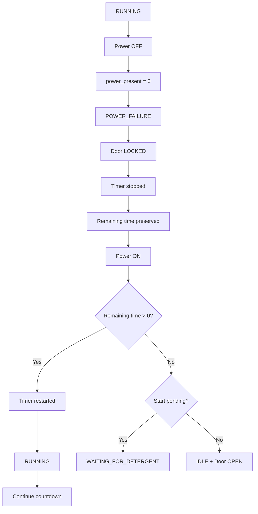

## 16. Concurrency

The simulator has two main execution paths.

| Execution path | Responsibility |
|---|---|
| Main thread | Reads menu input and performs machine operations |
| Timer thread | Sleeps for one second and calls `timer_tick()` |

Both access the shared `WashingMachine` structure.

The shutdown sequence is:

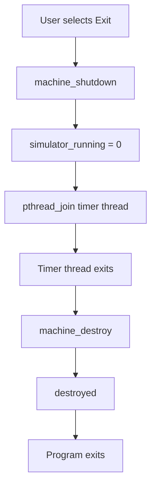

## 17. File Responsibilities

| File | Responsibility |
|---|---|
| `machine.c` | Core state machine, mode selection, Start/Abort, door, and detergent operations |
| `timer.c` | Mode durations, countdown, timer thread, and completion |
| `power.c` | Power failure and power restoration |
| `machine.h` | Machine data structures, states, and declarations |
| `timer.h` | Timer declarations |
| `power.h` | Power declarations |
| `main.c` | Program entry, timer-thread creation, input dispatch, and shutdown |
| `input.c` / `input.h` | User menu input |
| `display.c` / `display.h` | Machine status display |

### Primary Modified Files

The primary modified files are:

1. `machine.c`
2. `timer.c`
3. `power.c`

## 18. Source-Verified Behavior Summary

| Operation | Actual source behavior |
|---|---|
| Select mode | Allowed only when powered ON, valid mode, and not `RUNNING` or `WAITING_FOR_DETERGENT` |
| Start with door OPEN | Rejected |
| Start with door CLOSED and no detergent | Sets `WAITING_FOR_DETERGENT` and `start_requested` |
| Start with detergent | Loads selected duration, locks door, enters `RUNNING` |
| Fill detergent while waiting and door CLOSED | Starts cycle immediately |
| Fill detergent while waiting and door OPEN | Stays waiting until door is closed |
| Close door while waiting, detergent present | Starts cycle immediately |
| Open locked door | Rejected |
| Abort while running | Sets `ABORTED`, opens door, then resets to `IDLE` |
| Timer reaches zero | Sets `COMPLETED`, opens door, then resets to `IDLE` |
| Power OFF while running | Stops timer, enters `POWER_FAILURE`, locks door, preserves remaining time |
| Power OFF while waiting | Enters `POWER_FAILURE` and locks door |
| Power OFF while idle | Power turns OFF but state remains unchanged |
| Restore power after interrupted running cycle | Resumes `RUNNING` if door is locked and remaining time > 0 |
| Restore power with locked door, zero time, and pending Start | Returns to `WAITING_FOR_DETERGENT` |
| Other power restoration case | Resets to `IDLE` with door OPEN |

## 19. Important Source-Level Notes

### `COMPLETED` and `ABORTED` are temporary

Both states are assigned in the code, but both are immediately followed by a reset to `IDLE`. They are therefore best represented as **transitional states**, not stable operating states.

### Power OFF does not always mean `POWER_FAILURE`

`power_failure()` only assigns `POWER_FAILURE` when the current state is:

- `RUNNING`, or
- `WAITING_FOR_DETERGENT`

If the machine is in another state, the code simply turns power OFF and preserves the current state.

### The timer thread does not stop when power is OFF

The thread itself continues sleeping and checking `simulator_running`. `timer_tick()` simply returns without decrementing while power is unavailable or the machine is not running.


## Summary

The simulator is a state machine driven by user operations in the main thread and a one-second timer thread.


