# weighted_rr
The weight of each master is defined as the grant time slice that the master can configure in the arbiter. If all the masters have the same amount of weight, each master will get an equal time. If master A requests 20 cycles and master B requests 10 cycles, master A will get grant 2 times longer than master B. One disadvantage of letting the masters configure the weight is that a master may configure a very large weight. To reduce this large weight problem, another global configurable maximum allowed weight is added. A master may request a very large weight value, but the arbiter will only grant up to the maximum allowed
weight if there are other masters waiting.

# weight decoder
Weight decoder decodes one-hot grant to decode the correct weight of the granted master. Weight of the masters are concatenated to form a weight bus, the width of the bus can be calculated by the width of a single weight and the total number of masters in the arbiter. Weight decoder takes the current grant as an one-hot input. The input grant is decoded to produce an index for correct bit slice positions of the weight bus. For example, if the grant is b ′0010, the index output is 1. Index of 1 stands for the master no. 1. The weight of master 1 is decoded as an output. If the grant is b ′0100, index output is 2. The weight of master 2 is decoded as an output.


# Next Grant Precalculator
Next Grant PReCalculator(NGPRC) calculates the next possible grants mask based on the current grant. By precalculating the next possible grants, NGPRC dictates the Round Robin arbitration of the arbiter. For example, if all 4 masters in the arbiter are requesting and the current grant is master 1, the next possible grant is restricted to be in the order of master 2, master 3 and master 0. The arbiter cannot skip master 2 to grant master 3. It would violate the Round-robin scheme and it is not allowed. By giving the next possible grant priority to the Grant State-machine, it forces the grant to be in strict Round-robin order. . For example, if the current grant is b′0010, rotate left gives b ′0100. After inversion, the bits become b ′1011. After increment by 1, the next possible grant becomes b ′1100. It means the leftmost 2 bits are in line in priority.

# Grant State Machine
Grant state machine is the logic to calculate which master gets the grant and for how long based on the weight. The grant logic is based on the requests and next grant priority mask created by NGPRC. “Grant Process” state masks requests using a precalculated mask to grant the next requesting master. After the grant is decided, it moves to the “Get Weight” state to fetch the weight of the grant from Weight Decoder. After that, it moves to the “Count” state to count the clock cycles until the local counter reaches the desired weight.


# Output


# Coverage:


# Prepared by:
B M Madhumitha


# References

Toe, Aung, "Design and Verification of a Round-Robin Arbiter" (2018). Thesis. Rochester Institute of Technology

# Washing Machine Simulator — Behavior & Control Flow

**Name:** B M Madhumitha  
**Course:** PhD ESE  
**SR No.:** 04-01-00-10-12-26-01-28178

## Overview

This project is a console-based washing machine simulator written in C using POSIX threads (`pthread`).

The main machine behavior is implemented in three modified files:

| File | Responsibility |
|---|---|
| `machine.c` | Machine state, wash-mode selection, start/abort operations, door control, and detergent logic |
| `timer.c` | Wash durations, countdown timer, timer thread, and cycle completion |
| `power.c` | Power-off handling and recovery after power restoration |

Supporting files provide the program entry point, menu/input handling, status display, and declarations.

> **Simulation rule:** 1 real second represents 1 simulated minute.

---

## Machine State Model

The `WashingMachine` structure contains the following important variables:

| Variable | Purpose |
|---|---|
| `mode` | Currently selected wash mode |
| `state` | Current machine state |
| `door_status` | Door condition: open, closed, or locked |
| `remaining_time` | Remaining simulated wash time in minutes |
| `detergent_present` | Indicates whether detergent has been filled |
| `start_requested` | Indicates that Start was requested while detergent was missing |
| `timer_running` | Indicates whether the countdown is active |
| `power_present` | Indicates whether power is available |
| `simulator_running` | Controls execution of the timer thread |
| `mutex` | Protects shared machine state between threads |

### Wash Modes

| Mode | Duration |
|---|---:|
| Heavy | 45 minutes |
| Normal | 30 minutes |
| Light | 20 minutes |

### Machine States

The code defines six states:

- `IDLE`
- `WAITING_FOR_DETERGENT`
- `RUNNING`
- `POWER_FAILURE`
- `COMPLETED`
- `ABORTED`

`COMPLETED` and `ABORTED` are temporary states. The machine is immediately reset to `IDLE` after either condition.

---

## Initial Startup

`machine_init()`:

1. Initializes the mutex.
2. Turns power ON.
3. Sets `simulator_running = 1`.
4. Resets the machine to `IDLE`.

Initial condition:

| Property | Initial value |
|---|---|
| Power | ON |
| Mode | NONE |
| State | IDLE |
| Door | OPEN |
| Remaining time | 0 |
| Detergent | EMPTY |
| Start request | NONE |
| Timer | STOPPED |

The timer thread is then created by `main.c`.

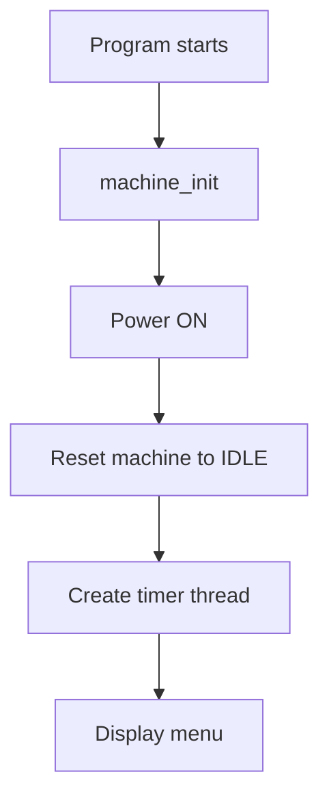

---

## Selecting a Wash Mode

The user can select Heavy, Normal, or Light mode.

Before changing the mode, `machine_select_mode()` verifies:

1. Power is ON.
2. The machine is not in `POWER_FAILURE`.
3. The selected mode is valid.
4. The machine is not `RUNNING`.
5. The machine is not waiting for detergent with a pending Start request.

If all checks pass, the selected mode is stored.

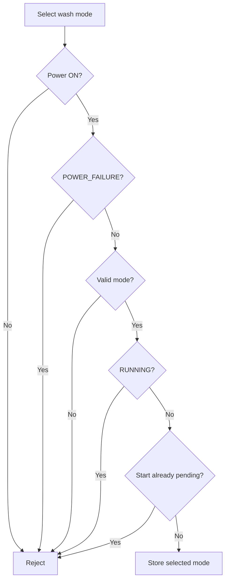

---

## Starting a Wash Cycle

The Start operation is handled by:

- `machine_start()`
- `machine_start_locked()`

For a cycle to start immediately, the following conditions must be satisfied:

- Power is ON.
- A valid wash mode is selected.
- The door is CLOSED.
- Detergent is PRESENT.

When the conditions are satisfied:

```text
remaining_time = selected mode duration
door_status = DOOR_LOCKED
state = RUNNING
timer_running = 1
start_requested = 0
```

### Start Without Detergent

If Start is pressed with the door closed but detergent is missing:

```text
start_requested = 1
state = WAITING_FOR_DETERGENT
timer_running = 0
```

The timer does not start.

The cycle can begin later when detergent is filled.

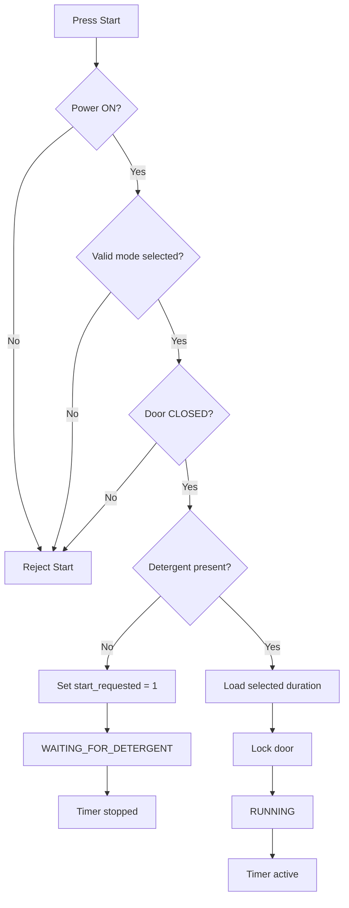

> **Important:** If Start is pressed while the door is OPEN, the code rejects the Start request. It does not create a pending detergent state.

---

## Door Behavior

### Opening the Door

`machine_open_door()` rejects the operation when:

- Power is OFF.
- The machine is in `POWER_FAILURE`.
- The door is already locked.

If the door is closed and opening is allowed:

```text
door_status = DOOR_OPEN
```

A locked door cannot be opened during a running wash.

### Closing the Door

`machine_close_door()` rejects the operation when:

- Power is OFF.
- The machine is in `POWER_FAILURE`.
- The door is already closed.
- The door is already locked.

Otherwise:

```text
door_status = DOOR_CLOSED
```

If a Start request is pending and detergent is already present, closing the door automatically starts the wash.

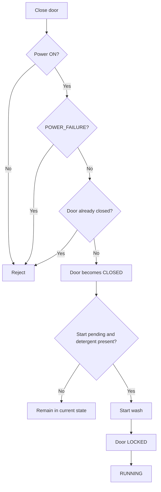

---

## Detergent Behavior

`machine_fill_detergent()` first checks:

- Power is ON.
- The machine is not in `POWER_FAILURE`.
- Detergent has not already been filled.

When successful:

```text
detergent_present = 1
```

### If Start Is Already Pending

If the machine is in `WAITING_FOR_DETERGENT`:

- If the door is OPEN, the machine waits for the user to close it.
- If the door is CLOSED, the wash starts immediately.

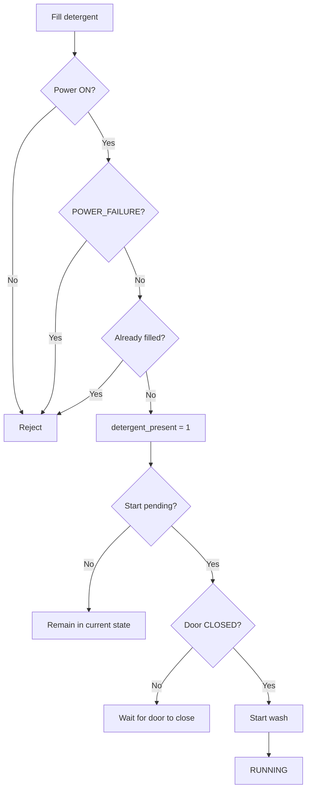

---

## Timer Thread

The timer is implemented using a separate pthread.

`timer_thread()` repeatedly:

1. Sleeps for one real second.
2. Checks `simulator_running`.
3. Calls `timer_tick()`.

Therefore:

```text
1 real second = 1 simulated minute
```

`timer_tick()` only decrements the timer when all three conditions are true:

```text
state == RUNNING
timer_running == 1
power_present == 1
```

Otherwise, the timer tick is ignored.

### Countdown

For every valid timer tick:

```text
remaining_time--
```

When `remaining_time` reaches zero, the wash cycle completes.

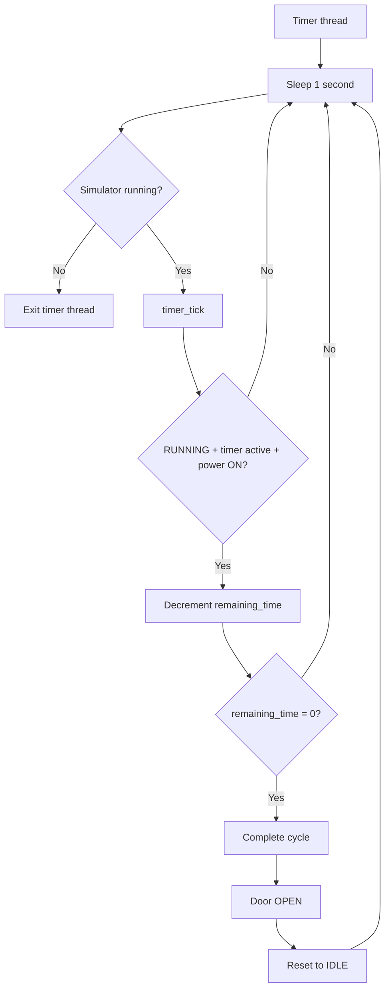

---

## Wash Completion

When the countdown reaches zero, `timer_tick()` first sets:

```text
state = COMPLETED
door_status = DOOR_OPEN
timer_running = 0
start_requested = 0
```

The machine then immediately resets to `IDLE`:

```text
mode = MODE_NONE
state = IDLE
door_status = DOOR_OPEN
remaining_time = 0
detergent_present = 0
start_requested = 0
timer_running = 0
```

The effective transition is:

```text
RUNNING → COMPLETED → IDLE
```

The door is opened as part of the completion/reset process.

---

## Abort Behavior

`machine_abort()` only performs an abort when:

```text
state == RUNNING
```

When a running cycle is aborted:

```text
state = ABORTED
door_status = DOOR_OPEN
timer_running = 0
start_requested = 0
```

The machine then calls `reset_to_idle()`.

Final state:

| Property | Value after abort |
|---|---|
| Mode | NONE |
| State | IDLE |
| Door | OPEN |
| Remaining time | 0 |
| Detergent | EMPTY |
| Start request | NONE |
| Timer | STOPPED |

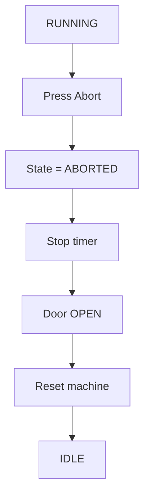

---

## Power-Off / Power-Failure Handling

Power behavior is implemented in `power.c`.

When power is switched OFF:

```text
power_present = 0
```

### Power Failure During RUNNING

If the machine is running:

```text
timer_running = 0
state = POWER_FAILURE
door_status = DOOR_LOCKED
remaining_time = unchanged
```

The remaining wash time is preserved.

For example:

```text
Normal cycle
      ↓
30 minutes
      ↓
8 timer ticks
      ↓
22 minutes remaining
      ↓
Power OFF
      ↓
POWER_FAILURE
      ↓
22 minutes preserved
```

The door remains locked until power is restored.

### Power Failure While Waiting for Detergent

If the machine is:

```text
WAITING_FOR_DETERGENT
```

power failure changes the state to:

```text
POWER_FAILURE
door_status = DOOR_LOCKED
```

The pending Start request remains stored.

### Power Off in Other States

For states other than `RUNNING` and `WAITING_FOR_DETERGENT`, the code turns power off while preserving the current machine state.

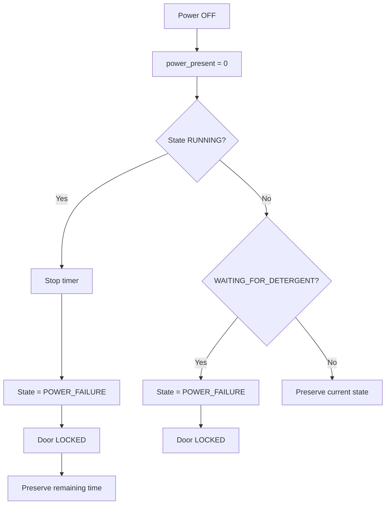

---

## Power Restoration

When power is restored:

```text
power_present = 1
```

If the machine was in `POWER_FAILURE`, `power_restore()` determines the recovery path.

### Interrupted Running Cycle

If:

```text
door_status == DOOR_LOCKED
remaining_time > 0
```

then:

```text
timer_running = 1
state = RUNNING
```

The wash resumes from the preserved remaining time.

### Pending Start / Detergent Case

If:

```text
door_status == DOOR_LOCKED
remaining_time == 0
start_requested == 1
```

then:

```text
state = WAITING_FOR_DETERGENT
timer_running = 0
```

### Other Recovery Cases

The machine is reset to:

```text
state = IDLE
door_status = DOOR_OPEN
```

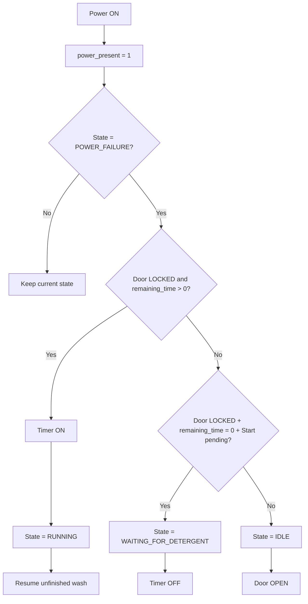

---

## Complete Normal Wash Flow

The direct successful path is:

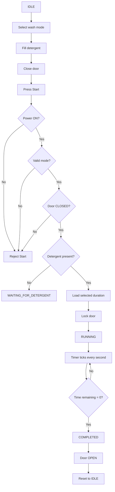

The order of filling detergent and closing the door can vary, provided the final Start conditions are satisfied.

---

## Start-Pending Flow

A pending Start request is created when:

- A valid mode is selected.
- The door is CLOSED.
- Start is pressed.
- Detergent is missing.

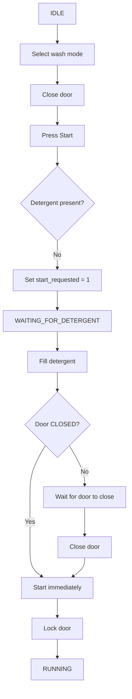

If Start is pressed while the door is OPEN, `machine_start()` rejects the request immediately.

---

## Power Interruption During a Wash

The main recovery sequence is:

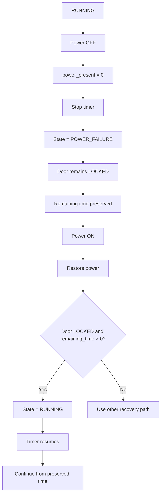

This is the key recovery behavior implemented in `power.c`.

---

## High-Level State Transition Diagram

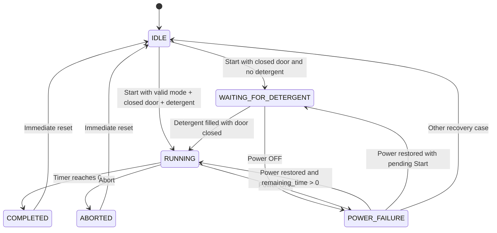

---

## Concurrency and Mutex Protection

The simulator has two active execution paths.

### Main Thread

The main thread:

- Reads user input.
- Selects modes.
- Starts or aborts cycles.
- Controls the door.
- Fills detergent.
- Controls power.
- Displays status.

### Timer Thread

The timer thread:

- Sleeps for one real second.
- Checks whether the simulator is still running.
- Calls `timer_tick()`.
- Updates the remaining wash time.

Both threads access the same `WashingMachine` structure.

A mutex protects shared state:

```c
pthread_mutex_lock(&machine->mutex);

/* Access or modify shared machine state */

pthread_mutex_unlock(&machine->mutex);
```

### Shutdown

When the user exits:

1. `machine_shutdown()` sets `simulator_running = 0`.
2. `main.c` waits for the timer thread using `pthread_join()`.
3. The timer thread exits.
4. `machine_destroy()` destroys the mutex.

---

## File Responsibilities

| File | Responsibility |
|---|---|
| `machine.c` | Core washing-machine state machine, mode selection, start/abort, door, and detergent logic |
| `timer.c` | Mode durations, countdown, timer thread, and completion |
| `power.c` | Power-off behavior and power restoration |
| `machine.h` | Machine state/data definitions and function declarations |
| `timer.h` | Timer declarations |
| `power.h` | Power function declarations |
| `main.c` | Program entry point, timer-thread creation, menu dispatch, and shutdown |
| `input.c` / `input.h` | Converts menu choices into `UserInput` values |
| `display.c` / `display.h` | Displays current machine status |

### Primary Modified Files

The three primary modified logic files are:

1. `machine.c`
2. `timer.c`
3. `power.c`

---

## Behavior Summary

| Operation | Required condition | Result |
|---|---|---|
| Select mode | Power ON, not running, no pending Start | Selected mode is stored |
| Start | Valid mode + closed door + detergent + power | Cycle starts and door locks |
| Start without detergent | Valid mode + closed door + no detergent | `WAITING_FOR_DETERGENT` |
| Fill detergent | Power ON and not in power failure | Detergent becomes present |
| Close door | Door is open and power is available | Door becomes closed; a pending cycle may start |
| Open door | Door is not locked and power is available | Door becomes open |
| Abort | Cycle is `RUNNING` | Cycle stops and machine resets to `IDLE` |
| Power OFF during run | Cycle is `RUNNING` | Timer stops and remaining time is preserved |
| Power ON after interruption | Locked door + remaining time > 0 | Cycle resumes |
| Timer reaches zero | Cycle is `RUNNING` | Cycle completes, door opens, and machine resets |

---

## Key Implementation Details

### Door After Completion

The supplied code changes the door status to `DOOR_OPEN` when the wash completes.

### Door After Abort

The supplied code changes the door status to `DOOR_OPEN` when the cycle is aborted.

### Remaining Time During Power Failure

When power fails during `RUNNING`, the remaining time is preserved.

### Timer During Power Failure

The timer is stopped during power failure and resumes only after the appropriate power-restoration path.

### Detergent Reset

After completion or abort, `detergent_present` is reset to `0`, so detergent must be filled again for the next cycle.

### Start During a Running Cycle

Pressing Start while `RUNNING` is ignored.

### Mode Change During a Running Cycle

Changing the wash mode while `RUNNING` is rejected.

### Mode Change While Start Is Pending

Changing the wash mode while `WAITING_FOR_DETERGENT` with a pending Start request is rejected.

---

## Recommended Flowcharts for Project Documentation

The following diagrams provide a complete explanation of the modified functionality:

1. **Normal Wash Flow**  
   Shows mode selection, detergent, door closure, Start, timer countdown, completion, and reset.

2. **Start-Pending Flow**  
   Shows what happens when Start is pressed before detergent is filled.

3. **Power Failure and Recovery**  
   Shows preservation of remaining time and resumption after power restoration.

4. **High-Level State Transition Diagram**  
   Shows the overall machine state machine.

5. **Concurrency Diagram**  
   Shows the relationship between the main thread, timer thread, shared machine state, and mutex.

---

## Summary

The washing machine simulator is implemented as a mutex-protected state machine.

- `machine.c` controls the machine's operating conditions and user actions.
- `timer.c` controls simulated wash time, countdown, and completion.
- `power.c` handles power failure and recovery.
- `main.c` connects the menu/input system to the machine operations.
- A separate timer thread updates the wash cycle once every real second.

The central behavior can be summarized as:

```text
IDLE
  ↓
Select Mode
  ↓
Prepare Door + Detergent
  ↓
Start
  ↓
RUNNING
  ↓
Timer Countdown
  ↓
COMPLETED
  ↓
IDLE
```

Power interruption provides an additional recovery path:

```text
RUNNING
  ↓
POWER_FAILURE
  ↓
Remaining Time Preserved
  ↓
Power Restored
  ↓
RUNNING
  ↓
Resume Countdown
```


